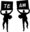

#  Introduction 
สวัสดีค่ะ วันนี้กลุ่มของพวกเราจะมานำเสนอโปรแกรม Money Saver ซึ่งเป็นโปรแกรมที่ช่วยในการบริหารการใช้เงินของผู้ใช้งานเพื่อให้ผู้ใช้งานโดยเฉพาะนักศึกษาหรือบุคคลทั่วไปสามารถทำการจดบันทึกรายรับ-รายจ่าย และวางแผนการใช้เงินได้อย่างง่ายดาย โปรแกรมนี้สร้างขื้นจากระบบ Linux โดยการใช้เพียงภาษา C ในการเขียน 100%

ดูโปสเตอร์ **[คลิก](https://github.com/cotver/money-saver_compro/blob/master/img/Poster.pdf)**
#  Installation 
* สำหรับการใช้งานนั้น ผู้ใช้จะต้องทำการ git clone เพื่อทำการนำโปรเจ็คเข้าสู่คอมพิวเตอร์ก่อน

* ระบบของเราจะทำงานได้ ผู้ใช้จะต้องมี GCC เพื่อทำการรันภาษา C
   * ระบบปฏิบัติการ Linux สามารถทำการรัน ผ่าน Command Line ได้ทันที
   * ระบบปฏิบัติการ Window สามารถโหลดโปรแกรมเพื่อทำการ GCC ได้ เช่น Cygwin, MinGW, Visual Studio และอื่นๆ

* ทำการไปที่โฟล์เดอร์หลักของโปรเจ็ค แล้วพิมพ์ `make && make run` ผ่าน Command Line เพื่อเป็นการ สร้างไฟล์ Executable (.exe) และโปรแกรมจะเปิดโปรแกรมขื้นมาให้ทันทีอัตโนมัติ สามารถใช้ระบบได้เลยทันที

> ภาพประกอบคอมไพล์โดยใช้Cygwin

# How to use 
ท่านสามารถรับชมวิดีโอสอนการใช้งานโปรแกรม **[ที่นี่](https://www.youtube.com/watch?v=NtKG8CkagG8)** 	:mag:

# Features 
สำหรับการใช้งานโปรแกรม Money Saver จะมีตัวเลือกต่างๆ ดังนี้
* การลงทะเบียนและเข้าสู่ระบบของผู้ใช้งาน
* ระบบจดบันทึกรายรับ-รายจ่าย
* ระบบวางแผนการใช้เงิน
* ระบบแสดงรายละเอียดการบริหารการเงิน

## Register and log in 
เมื่อเริ่มเข้าใช้งานเป็นครั้งแรก ระบบจะให้ผู้ใช้งานทำการลงทะเบียน ซึ่งข้อมูลจะประกอบไปด้วย
 * User name
 * Password
 * Full name
 
 

และเมื่อผู้ใช้งานมี account แล้ว ก็จะสามารถ login เข้าระบบได้ด้วย username และ password ที่ลงทะเบียนไว้

# Main menu 
ผู้ใช้งานสามารถพิมพ์เลขเพื่อเข้าไปใช้งานเมนูต่างๆของโปรแกรมได้ตามที่ต้องการ

## Dashboard 

ในส่วนนี้จะบันทึกกิจกรรมทางการเงินทั้งหมดของผู้ใช้งานไว้ โดยจะแสดง

* เงินคงเหลือ
* วันที่ทำกิจกรรมทางการเงิน
* เวลาที่ทำกิจกรรมทางการเงิน
* รายะเอียด
* รายรับ
* รายจ่าย

##  Record income 
ในส่วนนี้ ผู้ใช้งานสามารถบันทึกรายรับที่ได้มาโดยการบันทึกจะประกอบไปด้วย
* แหล่งที่มาของรายรับ
* จำนวนเงิน

##  Saving account 
ในส่วนนี้ จะเป็นส่วนที่ผู้ใช้งานสามารถวางแผนทางการเงินได้ โดยแบ่งเงินเก็บออกเป็น 2 ส่วน คือ
* เงินออม
* เงินที่เก็บเพื่อใช้ในสิ่งที่วางแผนไว้ เช่น ซื้อเสื้อผ้า ซื้อตั๋วคอนเสิร์ต

| พิมพ์ | การทำงาน |
| ---| -----|
| W | ออมเงินออม |
| P | สร้างแผนการใช้เงินทำบางอย่างจะต้องระบุ รายการและจำนวนเงินที่ต้องการออม |
| E | แก้ไขแผนทางการเงิน |

การวางแผนในการออมเงินเพื่อสิ่งหนึ่ง จะมีเปอร์เซ็นต์ของเงินที่เราออมไปได้ เมื่อออมครบจะขึ้น `Success`

##  Transfer to saving account 
เมื่อผู้ใช้งานสร้างแผนการเงินแล้ว ในส่วนนี้จะเป็นการเพิ่มเงินเข้าไปในแผนการเงินต่างๆที่ผู้ใช้สร้างไว้ 
ผู้ใช้งานสามารถเลือกแผนการเงินที่ต้องการออมเงินได้จากเลขหน้าข้อ และสามารถเพิ่มเงินได้ตามที่ต้องการ `จำกัดวงเงินสูงสุดคือเงินที่ผู้ใช้มี`

##  Account Setting 

| พิมพ์ | การทำงาน |
| ---| -----|
| 1 | เปลี่ยนรหัสผ่าน |
| 2 | ลบ Account ผู้ใช้งาน |

#  Shortcut key 
| พิมพ์ | การทำงาน |
| --| -----|
| B | ย้อนกลับ |
| Q | ออกจากโปรแกรม |
| O | ลงชื่อออกจากโปรแกรม |

#  Team Member 
| รูป| ชื่อ นามสกุล | รหัสนักศึกษา | GitHub Username |
| --| -----| -----| -----|
|  | น.ส.กนกพรรณ ตันนิธิสถาพร | 61070002 |[@Ganokpan](https://github.com/Ganokpan)
|  | นายธนโชติ จิรกิตติ์สกุล | 61070069 |[@cotver](https://github.com/cotver)
|  | นายเนมินทร์ รุ่งศรีทอง | 61070107 |[@nemin555](https://github.com/nemin555)
|  | นางสาวปนัดดา อนันต์ | 61070112 |[@pickapp112](https://github.com/pickapp112)

#  Assistant Teacher 
|ผศ. ดร. กิติ์สุชาต พสุภา|ผศ. ดร. ปานวิทย์ ธุวะนุติ|
|:-:|:-:|
|||

รายงาน และ ซอร์สโค้ดนี้ เป็นส่วนหนึ่งของวิชา การสร้างโปรแกรมคอมพิวเตอร์ Computer Programming (06016206) 
หลักสูตรวิทยาศาสตร์บัณฑิต สาขาวิชาเทคโนโลยีสารสนเทศ 
ภาคเรียนที่ 2 ปีการศึกษา 2561 
คณะเทคโนโลยีสารสนเทศ 
สถาบันเทคโนโลยีพระจอมเกล้าเจ้าคุณทหารลาดกระบัง 

